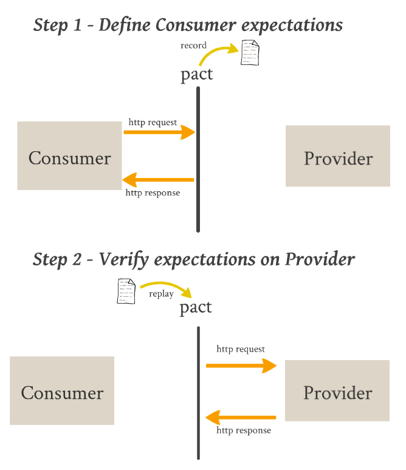

# pact-broker-tests

Sample project showing how to execute **Pact** tests. Here you can find 2 `Java` projects and 1 `broker`:

 - **broker**: keeps the the pacts and it's versions to be used between the tests
 - **consumer**: the project that uses the provider api and is responsible by the pacts publication
 - **provider**: the project that verifies if the pacts match with it's own api

 #### Documentation
  - https://docs.pact.io/pact_broker
  - Following is the basic **Pact** flow to verify contracts. The `broker` comes to centralize `pacts` and keep them simpler to share

    

 #### Tools

 - **java**: `17.0.1`
 - **docker**: `20.10.7`
 - **docker-compose**: `1.29.2`
 - **pact-broker cli**: `1.50.0` 
 - **gradle**: `7.2`
 - **wiremock**: `2.31.0` (lives inside the tests)
 - **pact-broker**: `2.89.1.0` (lives inside `docker`)
 - **postgres**: `14.0` (lives inside `docker`)

#### How to run

1. First of all, export the following variables to use during the tests:
    ```
    $ export BROKER_URL="http://localhost:9292" && \
      export CONSUMER_VERSION="1.0.0" && \
      export PROVIDER_VERSION="1.0.0" && \
      export TAG="dev"
    ```
2. Start the **Pact Broker**. If this command executes successfully, the `broker` will be exposed at `http://localhost:9292`:
    ```
    $ docker-compose up
    ```
3. Execute the `consumer` tests. These tests are going to generate the pact in the `./consumer/build/pacts/` folder:
    ```
    $ consumer/./gradlew -p ./consumer :test --tests '*Pact*'
    ```
4. Publish the `pacts` to the `broker`:
    ```
    $ pact-broker publish "./consumer/build/pacts" \
        --consumer-app-version $CONSUMER_VERSION \
        --broker-base-url $BROKER_URL \
        --tag $TAG
    ```
5. Execute the `provider` tests. These tests are going to verify if the interactions between `consumer` and `provider` are correct, using an http `mock` to check the results against the **Pact Broker**:
    ```
    $ PACT_PROVIDER_VERSION=$PROVIDER_VERSION \
        provider/./gradlew \
        -p ./provider \
        :test --tests '*Pact*'
    ```

6. Create a tag for the `provider` to keep the `can-i-deploy` command simpler:
    ```
    $ pact-broker create-version-tag \
        --pacticipant "users-provider" \
        --version $PROVIDER_VERSION \
        --tag $TAG \
        --broker-base-url $BROKER_URL
    ```

7. Check if the `provider` can be deployed:
    ```
    $ pact-broker can-i-deploy \
        --pacticipant "users-provider" \
        --to $TAG \
        --version $PROVIDER_VERSION \
        --broker-base-url $BROKER_URL

    Computer says yes \o/

    CONSUMER       | C.VERSION | PROVIDER       | P.VERSION | SUCCESS? | RESULT#
    ---------------|-----------|----------------|-----------|----------|--------
    users-consumer | 1.0.0     | users-provider | 1.0.0     | true     | 1

    VERIFICATION RESULTS
    --------------------
    1. http://localhost:9292/pacts/provider/users-provider/consumer/users-consumer/pact-version/c6c22a2291ec062638f45a405ecf58c0cbec05bf/metadata/Y3ZuPTEuMC41/verification-results/216 (success)

    All required verification results are published and successful
    ```

7. Check if the `consumer` can be deployed:
    ```
    $ pact-broker can-i-deploy \
        --pacticipant "users-consumer" \
        --to $TAG \
        --version $CONSUMER_VERSION \
        --broker-base-url $BROKER_URL

    Computer says yes \o/

    CONSUMER       | C.VERSION | PROVIDER       | P.VERSION | SUCCESS? | RESULT#
    ---------------|-----------|----------------|-----------|----------|--------
    users-consumer | 1.0.0     | users-provider | 1.0.0     | true     | 1

    VERIFICATION RESULTS
    --------------------
    1. http://localhost:9292/pacts/provider/users-provider/consumer/users-consumer/pact-version/c6c22a2291ec062638f45a405ecf58c0cbec05bf/metadata/Y3ZuPTEuMC4w/verification-results/215 (success)

    All required verification results are published and successful
    ```

#### How to test a failure

1. After executing the previous steps, go to the `provider` test `UsersPactTest.java` and change the `JSON` body to have have the **ID = 2**

2. Execute the tests again. They must fail:
    ```
    $ PACT_PROVIDER_VERSION=$PROVIDER_VERSION \
        provider/./gradlew \
        -p ./provider \
        :test --tests '*Pact*'
        
    java.lang.AssertionError: Pact between users-consumer (1.0.0) and users-provider - Upon Should return all available properties in response body. 
    Failures:

    1) Verifying a pact between users-consumer and users-provider - Should return all available properties in response body. has a matching body

        1.1) body: $.id Expected '1' (String) but received '2' (String)
    ```
3. If you try to check if the `provider` deployment can be executed:
   ```
   $ pact-broker can-i-deploy \
      --pacticipant "users-provider" \
      --to $TAG \
      --version $PROVIDER_VERSION \
      --broker-base-url $BROKER_URL

    Computer says no ¯_(ツ)_/¯

    CONSUMER       | C.VERSION | PROVIDER       | P.VERSION | SUCCESS? | RESULT#
    ---------------|-----------|----------------|-----------|----------|--------
    users-consumer | 1.0.0     | users-provider | 1.0.0     | false    | 1

    VERIFICATION RESULTS
    --------------------
    1. http://localhost:9292/pacts/provider/users-provider/consumer/users-consumer/pact-version/47c8ebf1805daafccc2f7eae273306bfd3d941bf/metadata/Y3ZuPTEuMC4w/verification-results/201 (failure)

    The verification for the pact between the latest version of users-consumer with tag dev (1.0.0) and version 1.0.0 of users-provider failed
   ```
3. If you try to check if the `consumer` deployment can be executed:
   ```
   $ pact-broker can-i-deploy \
      --pacticipant "users-consumer" \
      --to $TAG \
      --version $CONSUMER_VERSION \
      --broker-base-url $BROKER_URL

    Computer says no ¯_(ツ)_/¯

    CONSUMER       | C.VERSION | PROVIDER       | P.VERSION | SUCCESS? | RESULT#
    ---------------|-----------|----------------|-----------|----------|--------
    users-consumer | 1.0.0     | users-provider | 1.0.0     | false    | 1

    VERIFICATION RESULTS
    --------------------
    1. http://localhost:9292/pacts/provider/users-provider/consumer/users-consumer/pact-version/47c8ebf1805daafccc2f7eae273306bfd3d941bf/metadata/Y3ZuPTEuMC4w/verification-results/201 (failure)

    The verification for the pact between version 1.0.0 of users-consumer and the latest version of users-provider with tag dev (1.0.0) failed
   ```